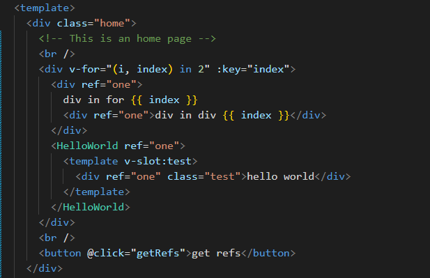
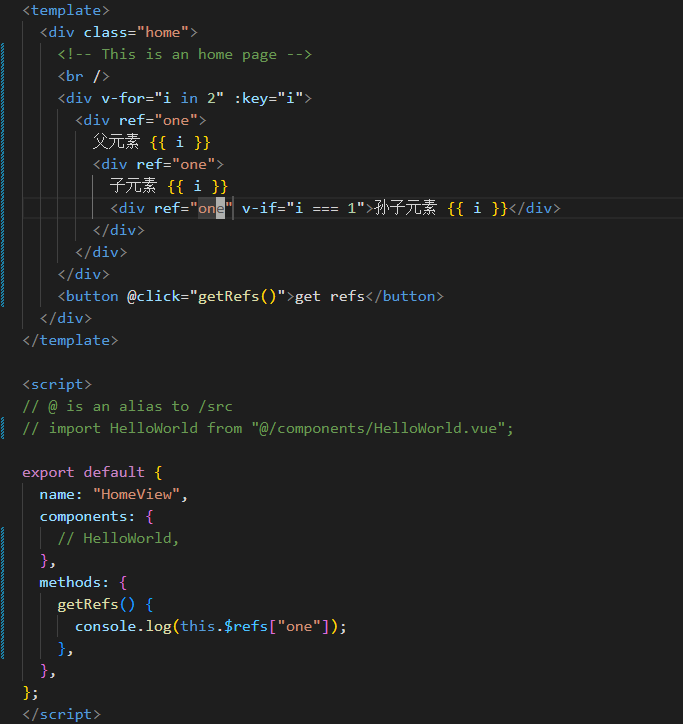

# ref

template

result

- 当`v-for`中没有重名`ref`时会返回只有一条数据的数组，所以只要获取`v-for`中的`ref`就必然会拿到一个数组，所以在处理数据的时候要注意。看下图，我们使用`index`动态渲染`ref`保证了`ref`的唯一。

template

result

- 接下来讨论一下`v-for ref`获取的元素的顺序问题，我们来看出现多层级同名`ref`的情况，简单来说 从里到外，从上到下。看下图。

template

result

- 再来看看`v-for` 包含组件的时候是否有什么区别，看下图。

template

result

- 可以看到也是遵循上述规则的。